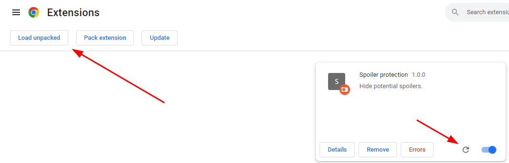

# Spoiler-protection

## Introduction

I've had character deaths or (e)sports match outcomes spoiled too often. This extension prevents it from happening.

## Functionality

This extension provides some rudimentary protection against accidental spoilers while browsing. Current functionality includes:

- Hide the YouTube comments section until it is clicked.
- Filter out search results based on keywords.

## Instructions

1. Run tsc build to generate js file (ctrl+shift+b).
2. Go to Chrome extensions.
3. Click 'Load unpacked' and select this folder.
4. To reload extension after update, press the reload arrow button on the extensions page.

## TODO

- Add search hiding in YouTube.
- For each keyword for search result removal, check if it is in the search query first.
- Add enable/disable button to google (and youtube).
